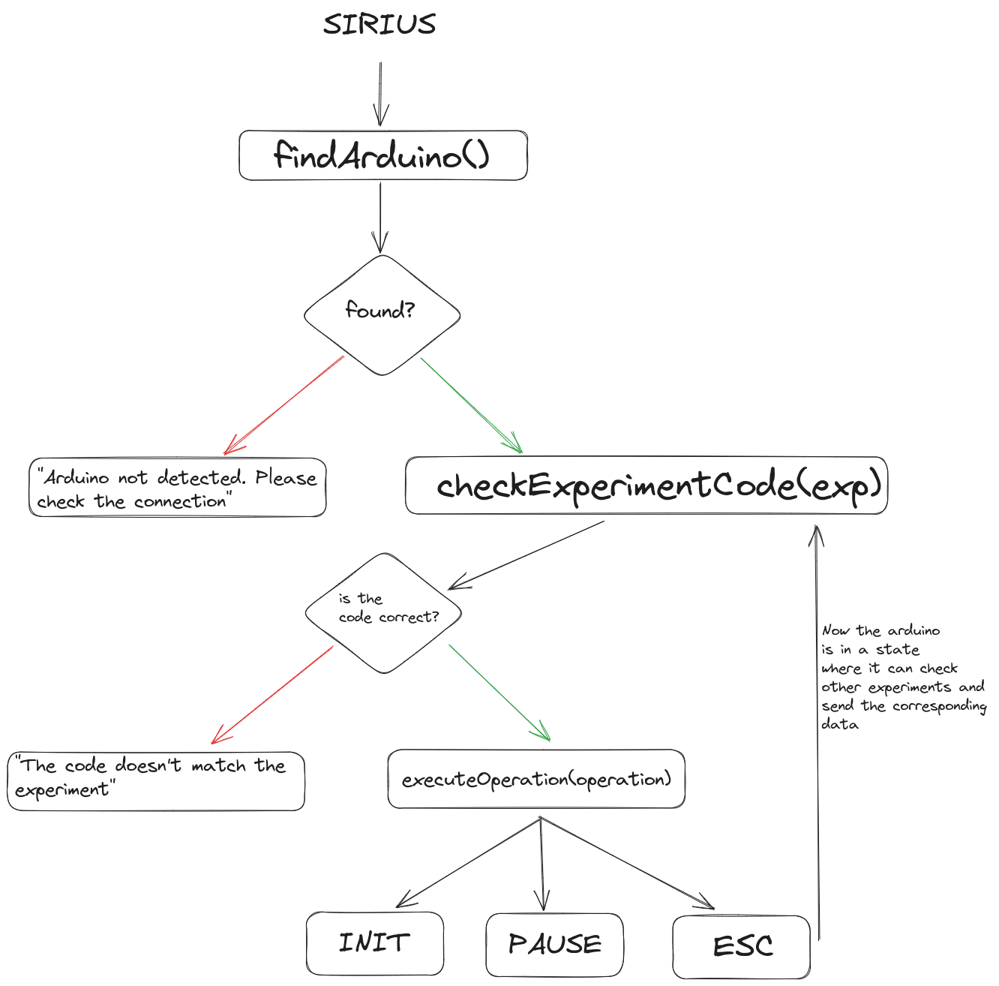

# Introduction
Hi, everyone! Welcome to the Sirius's back-end documentation. Here you will find all the information you need to understand how the back-end of the project works. This documentation is divided in the following sections: 

- [Technologies](#technologies)
- [Installation](#installation)
- [Server API](#server)
- [Web-socket API](#api)


# Technologies
Sirius is built with **NodeJS** and **Fastify** in order to provide a high performance and developer friendly experience. Along with these technologies, Sirius uses  two main third-party libraries to achieve low-level functionalities such as web-sockets or manage hardware: **Socket.IO** and ***SerialPort** 

# Installation
...

# Server
Sirius is an app that works with hardware. In order to receive data from this hardware, it should exists a module to manage this serial communication. Well, that's why  **PortManager** exists. Let's understand how this connection works.

### The server-hardware communication
Is important to understand what's the expected process in order to establish a communication between Sirius and your hardware device. Take a look at this brief diagram:



### Port manager object
The first thing you need to know is that all the functions in the diagram are methods of a PortManager object. These methods are exported at the end of the file. From now on when we use PortManager.method() we're using this object
```
// port-manager.mjs
export {  
    findArduino,  
    checkExperimentCode,  
    getParser,  
    executeOperation,  
    PORT_OPERATIONS  
};

// example.mjs

import * as PortManager from "../hardware/port-manager.mjs"
PortManager.findArduino();
```

### findArduino()
```
PortManager.findArduino(): JSON
```
This method returns a JSON with two keys: 
- **response**:  is the state of the operation. It can be true or false
- **message**:  is a description of what happened. It can be "Arduino detected" , "Arduino not found" or an error message

The **response** value depends if the Arduino is found or not. In case the Arduino is found, the method **opens the port** ([openPort()](#openPort)) where the Arduino is located and returns *True*; it returns false otherwise. Of course, if you need this method to behave in a different way you can change it (benefits of open source code) 

### checkExperimentCode(*experiment*)
```
PortManager.checkExperimentCode('Experiment Name'): JSON
```
Most of the methods return a JSON with the **response** and **message** keys. In this case, the value of **response** depends if the code in the Arduino matches with the given experiment. The logic behind this is that every time we want to start an experiment, the Arduino needs to verify that the given experiment exists in his code. In case it exists, it should **return the name of the experiment**. So if you want to check if the experiment *'FreeFall'* is in the Arduino, the Arduino should respond with *'FreeFall'*. This way we ensure that everything is going to work as expected.

If you don't know how to make your Arduino behave this way, take a look of our [documentation](#).

### executeOperation()
```
PortManager.executeOperation(PORT_OPERATIONS.INIT): JSON
```
Technically, this method prints certain strings to the port. This strings are read by the Arduino and processed. Just like the other methods, this returns a JSON with:
- **response**: it can be true or false
- **message**: it can be 'Operation executed successfully' or another error message like 'Invalid operation'

What makes the **response** value *true* or *false* is if there is a problem while writing to the port or if the operation doesn't exists in the [PORT_OPERATIONS](#PORT_OPERATIONS) dict. If none of these cases happens, **response** is just *true*.

### openPort()
```
PortManager.openPort(): Promise
```
**openPort()** opens the port where the Arduino is located and pipes a **DelimiterParser** to the port. It returns a promise. This promise, when solved, can return two values:

- *True*: the **SerialPort** instance is created successfully and the Arduino sent a message indicating that is completely loaded
- *err*: a problem happened opening the port

### getParser()
```
PortManager.getParser(): DelimiterParser
```
It's likely that you'll need the parser object outside of the **PortManager** module. To solve this problem, the **getParser()** method returns the **DelimiterParser** instance so you can manage what to do when data from the Arduino is sent

## PORT_OPERATIONS
The name says it all. This is a dictionary where all the operations that can be executed are stored. It looks like this:
```
const PORT_OPERATIONS = {PAUSE: 'PAUSE', INIT: 'INIT', ESC: 'ESC'};
```

Before you continue reading, make sure your hardware device **supports these operations**. You can learn how to support them  [here]().
### INIT
In case you didn't notice, it's a contraction for *INITIALIZATION* and basically starts the data transmission between the hardware and the server. The data from the hardware is sent as a string, but in a JSON format in order to be parsed in NodeJS.

This operations is **not restricted** to the first time you start the communication. If you paused the data transmission, you can resume it using **INIT**.

### PAUSE
At some point you would like to stop receiving data, right? But it would be a headache if every time you stop the stream, the port is closed. With **PAUSE** you keep the communication between the server and the hardware, but the data transmission is truly paused and not stored in an internal buffer. 

### ESC
It's the contraction of *ESCAPE*. This is an special operation because it "changes" the actual state of the hardware device to a listening state. You can add as much operations as you like to this dictionary. Just take in account that the key of the operation **must be** the same as the value. For example: **{STOP: 'STOP'}**

## API
Yeah, yeah, the server has a beautiful structure, but we're sure you don't want to deal directly with all those methods. That's why we provide a **web-socket based API** to make your application work like magic. Before start, take a look at what's the expected process to establish a proper communication between your app and the hardware [here](#server)

### Setup
Our web-socket API uses [SocketIO](). To establish the connection with the server, make sure to install the socket.io-client in your front-end app
```
npm i socket.io-client
```

Now, connect to the back-end server:
```
//somewhere.mjs

import {io} from "socket.io-client"

const socket = io('http://localhost:3000');
```

And you're ready to go!
### Events
A web-socket emits and listens to events. In your application, you just need to emit certain events and listen to the responses. To make easier the process, when an event is emitted you just need to listen to the same event. Here's an example:
```
socket.emit('someEvent');

socket.on('someEvent', response =>{
	//do stuff
});
```

#### findArduino
```
socket.emit('findArduino');
```
This event triggers the [findArduino()](#findArduino) method. With this, you can check if there are hardware devices connected to your computer and open the port
#### checkExperiment
```
socket.emit('checkExperiment', 'FreeFall');
```
Triggers the [checkExperimentCode(exp)](#checkExperimentCode(experiment)) method. Please note that you **need to send** the experiment you want to check
#### startExperiment
```
socket.emit('startExperiment', runExperiment, 'responseEventName')
```
Triggers the [executeOperation(operation)](#executeOperation(operationToExecute)) method. This event expect two arguments: 
- **runExperiment**: do you want to start receiving data? You need to pass *true*. Oh, now you want to pause the data transmission? Pass a *false* value
- **responseEventName**: what's the name of the event you want to listen when data starts to be sent? It can be 'data' or the same name of the experiment you checked

Here's an example:
```
// somewhere.mjs

//1. Check if the code of the experiment exists
socket.emit('checkExperiment', 'FreeFall');

//2. Listen to the response
socket.on('checkExperiment', res => {

	//3. Starts the data transmission
	if(res.response === true){
		socket.emit('startExperiment', true, 'expData');
	}
	
});

//4. Listen to the data
socket.on('expData', data => {
	console.log(data);
});

```

#### changeExperiment
```
socket.emit('changeExperiment');
```
Triggers the [executeOperation(exp)](#executeOperation(operationToExecute)) method with the [ESC](#esc) operation. If you're receiving data from the **FreeFall** experiment, you can use this method to check the code for another experiment and start receiving the corresponding data.

